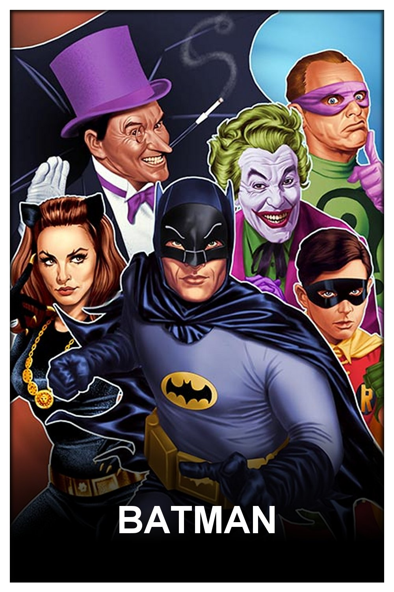
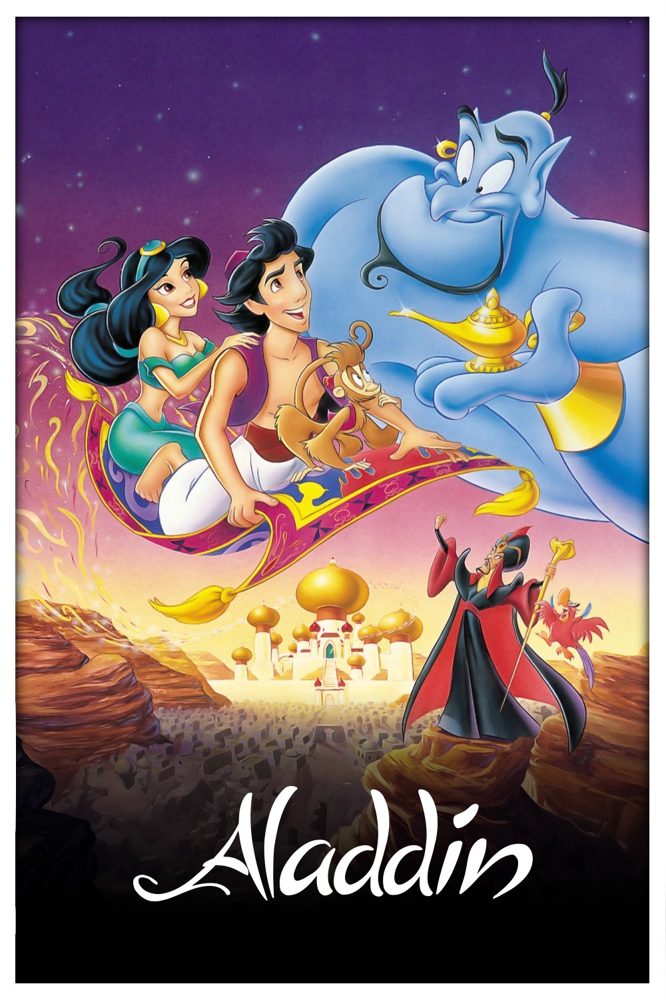
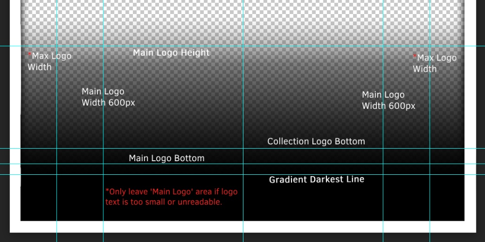

# Google drives

## Community baseline

| PRIORITY   (ASC) | PRIORITY INFO | CONTENT |
|--- | --- | --- |
| --  | LOWEST | Collection of other people their posters (Not necessarily conform to our style guidelines)|
| -  | LOW | Homemade posters (Example: foreign/local media) |
| +  | MEDIUM | Homemade posters (Can easily be exchanged within the same priority) |
| ++  | HIGH | Drazzilb drive (MM2K posters aka our holy grail) |
| +++  | HIGHEST | Custom folder/drive (Personal)(*) |

❗ [DAPS](https://github.com/Drazzilb08/daps) has the following priority ranking set: LOW -> HIGH (ASC)

❗❗ Remember, it remains a personal preference when using the recommendations posted below, this only serves as a baseline and is by no means the golden rule.

## MM2K-style Drives

| PRIORITY   (ASC) | OWNER | DRIVE ID | CONTENT | ACK | OWNER FEEDBACK |
|--- | --- | --- | --- | --- | --- |
| -- | Solen (#2)| 1zWY-ORtJkOLcQChV--oHquxW3JCow1zm | Collection of others | :white_check_mark: |  |
| -- | MajorGiant (#2) | 15sNlcFZmeDox2OQJyGjVxRwtigtd82Ru | Collection of others | :white_check_mark: |  |
| -- | Chris DC | 1oBzEOXXrTHGq6sUY_4RMtzMTt4VHyeJp | <li>Homemade   <li>Collection of others | :white_check_mark: | <li>Posters *without* number overlay</li>   <li>Posters *with* small "THE"/"A" overlay</li>   <li>Personal favorites</li>   <li>Homemade (variants)</li>   <li>Collection of others</li> | 
| - | Jpalenz77 | 1qBC7p9K4zur5dOCf3F6VTyUROVvHQoSb | Homemade   (Mostly niche media) | :white_check_mark: | Asked to be ranked lowest priority (of homemade posters) |
| - | WenIsInMood | 1Wz0S18sKOeyBURkJ1uT3RtkEmSsK1-PG | Homemade   Animes, Chinese, Japanese, Korean shows | :white_check_mark: | |
| - | Darkkazul | 1ejgRXwX6opexs8oAX8CnpSpKQt7Hrf00 | Homemade | ✅ | About 33% are Anime, Korean, Chinese, and Japanese shows/movies |
| - | Reitenth | 1cqDinU27cnHf5sL5rSlfO7o_T6LSxG77 | Homemade (95% Anime) | :white_check_mark: |  |
| - | TheOtherGuy (#2) | 15faKB1cDQAhjTQCvj8MvGUQb0nBORWGC | Homemade (OG titles: German) | :white_check_mark: | Movie, Series and Collection poster all in mm2k style with black gradient. BUT ALL posters are in **German** language, because original release title/language is German. For every poster in this drive there is an international version in my other drive. |
| - | TheOtherGuy (#1) | 1TYVIGKpSwhipLyVQQn_OJHTobM6KaokB | Homemade | :white_check_mark: | Movie, Series and Collection poster all in mm2k style with black gradient |
| - | Dweagle79 | 1XXZL-TpqWqfbKBWCifN2-MRdGDbSzHTj | Homemade | ✅ | <li>Homemade variants </li> <li> requests </li> |
| - | MiniMyself | 1ZhcV8Ybja4sJRrVze-twOmb8fEZfZ2Ci | Homemade | :white_check_mark: | <li>Homemade variants </li> <li> missing posters </li>|
| - | Kalyanrajnish| 1Kb1kFZzzKKlq5N_ob8AFxJvStvm9PdiL | Homemade   (Mostly Indian media) | :white_check_mark: |  |
| - | TokenMinal | 1KJlsnMz-z2RAfNxKZp7sYP_U0SD1V6lS | Homemade | :white_check_mark: | <li>Mostly Anime  <li>Some French media</li> <li>Mareau's posters</li> |
| - | Overbook874 (Tarantula212)| 1LIVG1RbTEd7tTJMbzZr7Zak05XznLFia | Homemade   (Mostly Bollywood/Indian media) | :white_check_mark: | <li>[TPDB](https://theposterdb.com/user/tarantula212)</li> <li>[Mediux](https://mediux.pro/user/tarantula212)</li>  |
| - | Dsaq| 1wrSru-46iIN1iqCl2Cjhj5ofdazPgbsz | Homemade   (Mostly Dutch media) | :white_check_mark: | Dutch media also have dutch filenaming |
| + | Quafley | 1G77TLQvgs_R7HdMWkMcwHL6vd_96cMp7 | Homemade   (Mostly Anime) | ❔ | Main focus is around animes (especially older lesser known ones). This includes movies. |
| + | Stupifier | 1bBbK_3JeXCy3ElqTwkFHaNoNxYgqtLug | Homemade | :white_check_mark: | To be placed as low as possible | 
| + | Sahara | 1KnwxzwBUQzQyKF1e24q_wlFqcER9xYHM | Homemade | :white_check_mark: | +1 rank with Stupifier | 
| + | MajorGiant (#1) | 1ZfvUgN0qz4lJYkC_iMRjhH-fZ0rDN_Yu | Homemade | :white_check_mark: | Can contain white text versions of black text MM2K posters |
| + | Lion City Gaming | 1alseEnUBjH6CjXh77b5L4R-ZDGdtOMFr | Homemade | :white_check_mark: | Can contain white text versions of black text MM2K posters | 
| + | IamSpartacus (#1) | 1HjwMWfI6XpQVYH36VBzYiJA4UWfoqcQ9 | Homemade | :white_check_mark: | <li> White text versions of black text MM2K posters Posters *without* number overlay </li> |
| + | BZ | 1Xg9Huh7THDbmjeanW0KyRbEm6mGn_jm8 | Homemade | :white_check_mark: | Can contain white text versions of black text MM2K posters |
| + | Solen (#1)| 1YEuS1pulJAfhKm4L8U9z5-EMtGl-d2s7| Homemade | :white_check_mark: | <li>Can contain no-gradient versions of MM2K posters</li>   <li>Different season posters per show</li>   <li>[TPDB](https://theposterdb.com/user/Solen)</li>   <li>[Mediux](https://mediux.pro/user/solen)</li>|
| + | Zarox | 1wOhY88zc0wdQU-QQmhm4FzHL9QiCQnpu | Homemade | :white_check_mark: | <li>[TPDB](https://theposterdb.com/user/zarox)</li>   <li>Can contain white text versions of black text MM2K posters</li> |
| ++ | Drazzilb | 1fKRkx4Yine5cqkH411FmShdd-wHRMBIF | MM2K | :white_check_mark: |  |
| +++ | PERSONAL CUSTOM FOLDER/DRIVE | YOU | PERSONAL | :white_check_mark: | (*)This can be used to override/replace posters from one of the drives (or personal/other collections) but don't want to change priorities for specific reasons</li> |

* Drives marked with ✅ in the ACK column are verified by the owner provided the feedback over their drive, it's contents and aware of their ranking

## CL2K-style Drives
Iamspartacus and dweagle79 started creating posters with the original logo on it instead of the name in Arial.
Some others joined the rebellion..

CL2K means "Clear Logo" and "2K" is because the main template is derived on the MM2K-style one.

| PRIORITY   (ASC) | OWNER | DRIVE ID | CONTENT | ACK | OWNER FEEDBACK |
|--- | --- | --- | --- | --- | --- |
| - | Mario CL2K | 1TDk1DCdYK6RFl-dg-HnNcnUV3MZ3MNwC | CL2K Homemade | ❗ | Logo's are bottom aligned on the main text, not the logo as a whole |
| - | Confused CL2K | 1l-cuRGy1JDpkmDrBWz46yr_xlT1CWNvQ | CL2K Homemade | ✅ |  |
| + | BZ CL2K | 1cEIuJRr8AZcthyVWfNn2skxog6R_MPrW | CL2K Homemade | ✅ |  |
| + | LionCityGaming CL2K | 1gJ_CXigGfZDJV5C3ZTaTz_yycgkROTJF | CL2K Homemade | :white_check_mark: |  |
| + | TokenMinal CL2K | 1FyjcjsP5Yb0w3u6QZHbjJ51j5zTT8lA5 | CL2K Homemade | :white_check_mark: | Anime |
| + | Jpalenz77 CL2K | 1kLvAjMx3jcJbRKjuMYTrUaA4hR4N8wfh | CL2K Homemade | :white_check_mark: | Only new content as of 28-06-2025 |
| + | MiniMyself CL2K | 1MNpR2fVRJt6bW5NIBPR43f6GvINcrw_o | CL2K Homemade | :white_check_mark: |  |
| ++ | Iamspartacus CL2K | 179QKyeP3avZvC_t4Fvk2Mm1nfRyuKvoc | CL2K Homemade | :white_check_mark: |  |
| ++ | Dweagle79 CL2K | 1R4tDkZVyG7iEbQ4DNbUPiPGfslPkcWmU | CL2K Homemade | :white_check_mark: |  |

### CL2K information
Based on MM2K posters.

When using Ben Dodson artwork finder, primarily use the `SingleColorContentLogo`.

When using TMDB, it's in `media` - `logos`

#### CL2K PSD high-level information
- Enable the guidelines/rulers in the psd
- Logo `placement` should be on the `correct guideline` as shown in the screenshot below
- `Width` of logo should be `600px` but exceptionally can be `800px`
- `Logo` should be `centered`
- `Logo` should be `as white as possible`

  

#### Source(s)
- [CL2K template PSD](CL2K/CL2K_template.psd)
- [Logo/artwork finder by Ben Dodson](https://bendodson.com/projects/apple-tv-movies-artwork-finder)
- [TMDB](https://www.themoviedb.org)

#### PSD's, not used by DAPS but good to have
| PRIORITY   (ASC) | OWNER | DRIVE ID | CONTENT | ACK | OWNER FEEDBACK |
|--- | --- | --- | --- | --- | --- |
|  | Mario CL2K PSD | 15y5mGCGzJKkMM6Nk6bu63Kak3QBlXALP | CL2K PSD | ❗ | Logo's are bottom aligned on the main text, not the logo as a whole |
|  | BZ CL2K PSD | 1x7A0L5ylknUWaEcMOl2MWjm4qbnSjc5T | CL2K PSD | ✅ | ? |
|  | TokenMinal CL2K PSD | 1dR8cAw1HPzTnQyXBnjFpiI6nxdO_OJS- | CL2K PSD | :white_check_mark: | ? |
|  | MiniMyself CL2K PSD | 1r3zwtZ4VbLGWWvQLZdUR8DwUVt9TE9VQ | CL2K PSD | :white_check_mark: | ? |
|  | Iamspartacus CL2K PSD | 1sQD0L_TjQN1_VFq1qu2OFueIZnSCMyUX | CL2K PSD | :white_check_mark: | ? |
|  | Dweagle79 CL2K PSD | 1ElqdLgwHHnOIpDNpV0IRXtJZHouGzRs9 | CL2K PSD | :white_check_mark: | ? |

## More details

### *Hybrid* drive(s)

Whenever a drive contains > 50% posters that are being collected from others, their priority should be set to lowest

#### Example

A nice example of this is my (Chris DC) drive.

It contains a few homemade posters, personal favorites as sometimes posters have slight variations or have been remade by others and then it falls into the collection of others.

In the list, since I know the posters are correctly made, they're above any other drive that is in the lowest priority, but also below any drive that contains > 50% custom made posters by the owner(s).

#####  How is this reflected in reality?

At this point, this drive is my custom folder/drive and personal for me.

My (Chris DC) drive is set to the highest priority, since it is my drive and I prefer to see these posters instead of another poster.

### When would you change priority for yourself?

So now you're wondering, why should I follow this baseline? What happens if I change the order of these drives?

#### Example

You're using this baseline in your configuration, but you have posters like:

*Before*

You don't like these posters and you figured out that there are other posters available or made for it.
* These can be found with using `poster_search.sh` or browsing and downloading them from the internet.
* If they're on a drive in the list you can change the priority and rerun everything.

But if it was that simple.. they might have posters that you personally don't like..

Here comes the custom folder in place, you just move the posters you want to replace to your custom folder, rerun everything et voila!

*After*

## Afterword

I would like to give a ***special thanks*** to all the owners and users for providing feedback and help in creating this page.
As well, not important to forget, ***big thanks*** to [MusikMann2000](https://theposterdb.com/user/musikmann2000) and all the people creating these posters as described in the guidelines and rules that are defined @ [DAPS](https://github.com/Drazzilb08/daps).

As of 23/05/2025 there's a [centralized gdrive repo](https://github.com/Drazzilb08/daps-gdrive-presets) containing these drives. DAPS and DAPS-UI will be making use of this.
