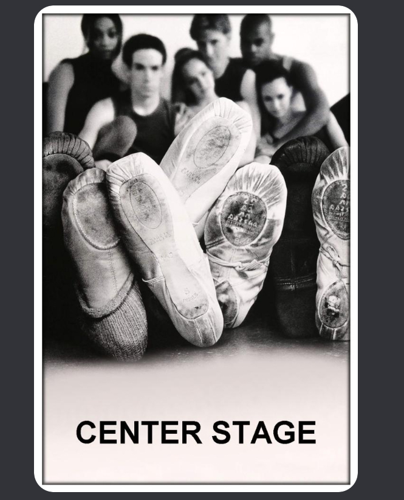
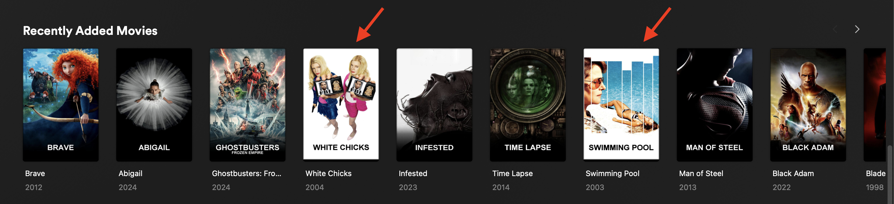
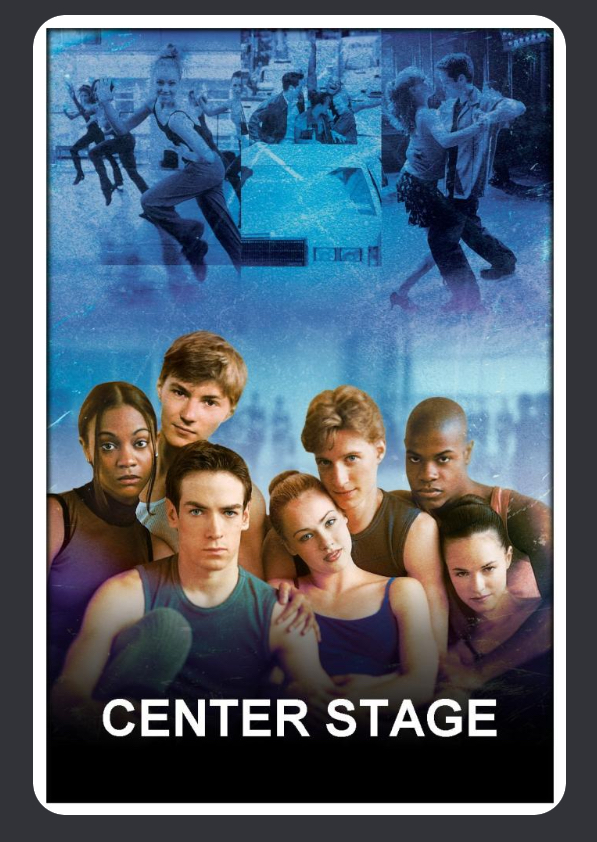
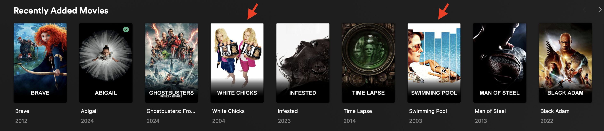

# Google drives

## Community baseline

| PRIORITY   (ASC) | PRIORITY INFO | CONTENT |
|--- | --- | --- |
| --  | LOWEST | Collection of other people their posters (Not necessarily conform to our style guidelines)|
| -  | LOW | Homemade posters (Example: foreign/local media) |
| +  | MEDIUM | Homemade posters (Can easily be exchanged within the same priority) |
| ++  | HIGH | Drazzilb drive (MM2K posters aka our holy grail) |
| +++  | HIGHEST | Custom folder/drive (Personal)(*) |

❗ [DAPS](https://github.com/Drazzilb08/daps) has the following priority ranking set: LOW -> HIGH (ASC)

❗❗ Remember, it remains a personal preference when using the recommendations posted below, this only serves as a baseline and is by no means the golden rule.

## Drives

| PRIORITY   (ASC) | OWNER | DRIVE ID | CONTENT | ACK | OWNER FEEDBACK |
|--- | --- | --- | --- | --- | --- |
| -- | Solen (#2)| 1zWY-ORtJkOLcQChV--oHquxW3JCow1zm | Collection of others | :white_check_mark: |  |
| -- | IamSpartacus (#2) | 1-WhCVwRLfV6hxyKF7W5IuzIHIYicCdAv | Collection of others | :white_check_mark: |  |
| -- | MajorGiant (#2) | 15sNlcFZmeDox2OQJyGjVxRwtigtd82Ru | Collection of others | :white_check_mark: |  |
| -- | Chris DC | 1oBzEOXXrTHGq6sUY_4RMtzMTt4VHyeJp | <li>Homemade   <li>Collection of others | :white_check_mark: | <li>Posters *without* number overlay</li>   <li>Posters *with* small "THE"/"A" overlay</li>   <li>Personal favorites</li>   <li>Homemade (variants)</li>   <li>Collection of others</li> | 
| - | Jpalenz77 | 1qBC7p9K4zur5dOCf3F6VTyUROVvHQoSb | Homemade   (Mostly niche media) | :white_check_mark: | Asked to be ranked lowest priority (of homemade posters) |
| - | MiniMyself | 1ZhcV8Ybja4sJRrVze-twOmb8fEZfZ2Ci | Homemade | :white_check_mark: | <li>Homemade variants </li> <li> missing posters </li>|
| - | Kalyanrajnish| 1Kb1kFZzzKKlq5N_ob8AFxJvStvm9PdiL | Homemade   (Mostly Indian media) | :white_check_mark: |  |
| - | TokenMinal | 1KJlsnMz-z2RAfNxKZp7sYP_U0SD1V6lS | Homemade | :white_check_mark: | <li>Mostly Anime  <li>Some French media |
| - | Mareau| 1hEY9qEdXVDzIbnQ4z9Vpo0SVXXuZBZR- | Homemade   (Mostly Anime/WebTV media) | :white_check_mark: | Asked to be ranked just before Collection drives |
| - | Overbook874 (Tarantula212)| 1LIVG1RbTEd7tTJMbzZr7Zak05XznLFia | Homemade   (Mostly Bollywood/Indian media) | :white_check_mark: | <li>[TPDB](https://theposterdb.com/user/tarantula212)</li> <li>[Mediux](https://mediux.pro/user/tarantula212)</li>  |
| - | Dsaq| 1wrSru-46iIN1iqCl2Cjhj5ofdazPgbsz | Homemade   (Mostly Dutch media) | :white_check_mark: | Dutch media also have dutch filenaming |
| + | Quafley | 1G77TLQvgs_R7HdMWkMcwHL6vd_96cMp7 | ❔ | ❔ |  |
| + | Stupifier | 1bBbK_3JeXCy3ElqTwkFHaNoNxYgqtLug | Homemade | :white_check_mark: | To be placed as low as possible | 
| + | Sahara | 1KnwxzwBUQzQyKF1e24q_wlFqcER9xYHM | Homemade | :white_check_mark: | +1 rank with Stupifier | 
| + | MajorGiant (#1) | 1ZfvUgN0qz4lJYkC_iMRjhH-fZ0rDN_Yu | Homemade | :white_check_mark: | Can contain white text versions of black text MM2K posters |
| + | Lion City Gaming | 1alseEnUBjH6CjXh77b5L4R-ZDGdtOMFr | Homemade | :white_check_mark: | Can contain white text versions of black text MM2K posters | 
| + | IamSpartacus (#1) | 1aRngLdC9yO93gvSrTI2LQ_I9BSoGD-7o | Homemade | :white_check_mark: | Can contain white text versions of black text MM2K posters |
| + | BZ | 1Xg9Huh7THDbmjeanW0KyRbEm6mGn_jm8 | Homemade | :white_check_mark: | Can contain white text versions of black text MM2K posters |
| + | Solen (#1)| 1YEuS1pulJAfhKm4L8U9z5-EMtGl-d2s7| Homemade | :white_check_mark: | <li>Can contain no-gradient versions of MM2K posters</li>   <li>Different season posters per show</li>   <li>[TPDB](https://theposterdb.com/user/Solen)</li>   <li>[Mediux](https://mediux.pro/user/solen)</li>|
| + | Zarox | 1wOhY88zc0wdQU-QQmhm4FzHL9QiCQnpu | Homemade | :white_check_mark: | <li>[TPDB](https://theposterdb.com/user/zarox)</li>   <li>Can contain white text versions of black text MM2K posters</li> |
| ++ | Drazzilb | 1VeeQ_frBFpp6AZLimaJSSr0Qsrl6Tb7z | MM2K | :white_check_mark: |  |
| +++ | PERSONAL CUSTOM FOLDER/DRIVE | YOU | PERSONAL | :white_check_mark: | (*)This can be used to override/replace posters from one of the drives (or personal/other collections) but don't want to change priorities for specific reasons</li> |

* Drives marked with ✅ in the ACK column are verified by the owner provided the feedback over their drive, it's contents and aware of their ranking

### More details

#### *Hybrid* drive(s)

Whenever a drive contains > 50% posters that are being collected from others, their priority should be set to lowest

##### Example

A nice example of this is my (Chris DC) drive.

It contains a few homemade posters, personal favorites as sometimes posters have slight variations or have been remade by others and then it falls into the collection of others.

In the list, since I know the posters are correctly made, they're above any other drive that is in the lowest priority, but also below any drive that contains > 50% custom made posters by the owner(s).

######  How is this reflected in reality?

At this point, this drive is my custom folder/drive and personal for me.

My (Chris DC) drive is set to the highest priority, since it is my drive and I prefer to see these posters instead of another poster.

#### When would you change priority for yourself?

So now you're wondering, why should I follow this baseline? What happens if I change the order of these drives?

##### Example

You're using this baseline in your configuration, but you have posters like:

*Before*

You don't like these posters and you figured out that there are other posters available or made for it.
* These can be found with using `poster_search.sh` or browsing and downloading them from the internet.
* If they're on a drive in the list you can change the priority and rerun everything.

But if it was that simple.. they might have posters that you personally don't like..

Here comes the custom folder in place, you just move the posters you want to replace to your custom folder, rerun everything et voila!

*After*

### Afterword

I would like to give a ***special thanks*** to all the owners and users for providing feedback and help in creating this page.
As well, not important to forget, ***big thanks*** to [MusikMann2000](https://theposterdb.com/user/musikmann2000) and all the people creating these posters as described in the guidelines and rules that are defined @ [DAPS](https://github.com/Drazzilb08/daps).
